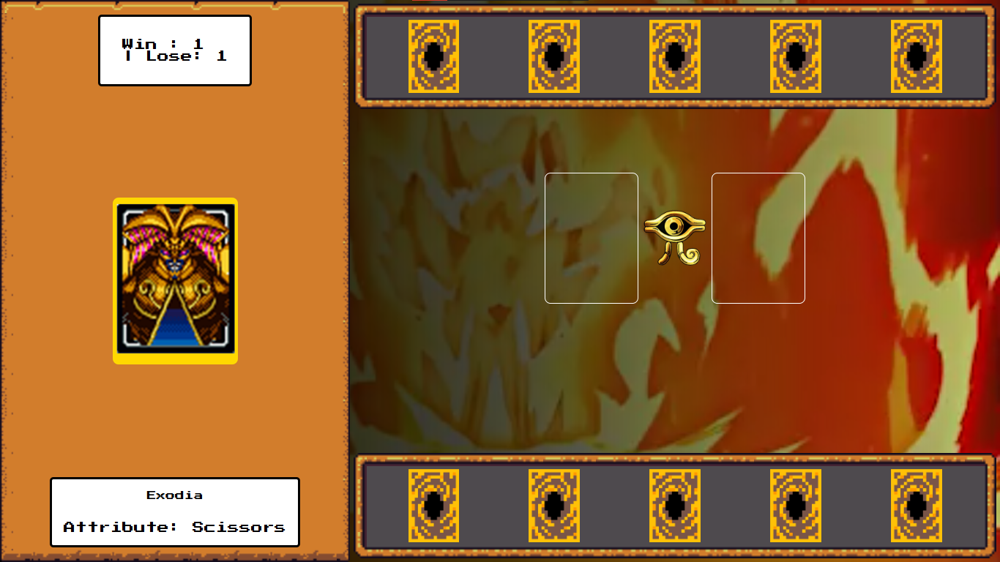

# 🃏 Yu-Gi-Oh! - Jo-Ken-Po Edition

Este é um projeto de jogo de cartas inspirado no universo de Yu-Gi-Oh!, utilizando a lógica clássica de **Jokenpô** (Pedra, Papel e Tesoura). O projeto foi desenvolvido como parte de um desafio de lógica de programação e manipulação de DOM.



## 🚀 Tecnologias Utilizadas

* **HTML5**: Estruturação semântica do campo de batalha.
* **CSS3**: Estilização visual com temas de RPG e Yu-Gi-Oh.
* **JavaScript (ES6+)**: Lógica do jogo, gerenciamento de estado e manipulação dinâmica de elementos.
* **Google Fonts**: Fonte "Press Start 2P" para aquele visual retrô de videogame.

## 🎮 Como Jogar

1.  **Início**: Ao abrir o jogo, a trilha sonora (BGM) é iniciada e as cartas são distribuídas.
2.  **Seleção**: Passe o mouse sobre as cartas na sua mão para ver os detalhes no painel à esquerda.
3.  **Duelo**: Clique em uma carta para jogá-la no campo. O computador escolherá uma carta aleatória simultaneamente.
4.  **Resultado**: 
    * **Papel (Blue-Eyes)** ganha de **Pedra**.
    * **Pedra (Dark Magician)** ganha de **Tesoura**.
    * **Tesoura (Exodia)** ganha de **Papel**.
5.  **Pontuação**: O placar é atualizado automaticamente. Clique no botão que aparecer para iniciar uma nova rodada.

## 🛠️ Funcionalidades Implementadas

* [x] **Sorteio sem Repetição**: Cartas na mão do jogador são únicas.
* [x] **Efeitos Sonoros**: Sons de vitória, derrota e música de fundo épica.
* [x] **Interface Responsiva**: Design focado na experiência do usuário (UI/UX).
* [x] **Estado Global**: Gerenciamento centralizado de pontuação e referências do DOM.

## 📦 Como rodar o projeto

1.  Clone este repositório:
    ```bash
    git clone [https://github.com/RenatoMacedoA/Yu-Gi-Oh-GAME.git](https://github.com/RenatoMacedoA/Yu-Gi-Oh-GAME.git)
    ```
2.  Navegue até a pasta do projeto e abra o arquivo `index.html` no seu navegador.
